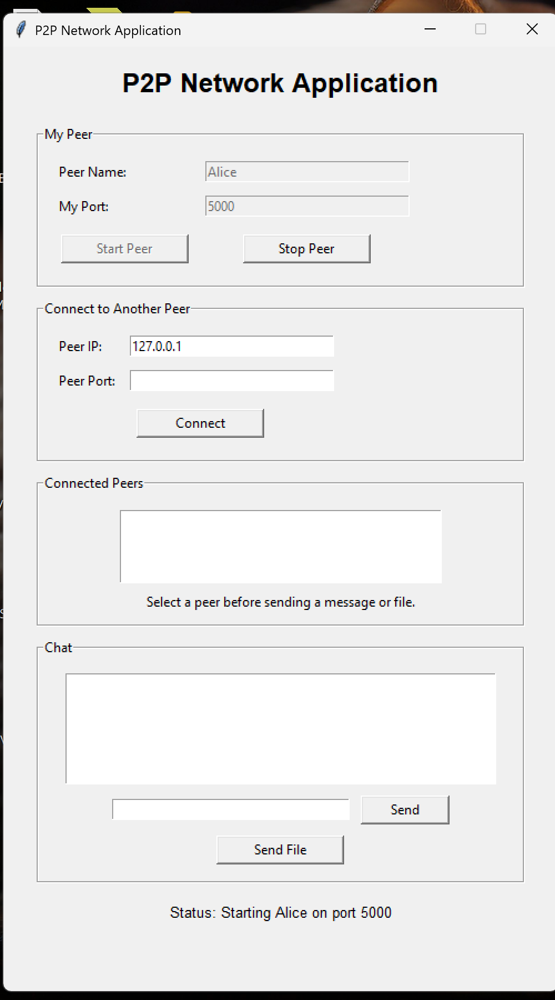
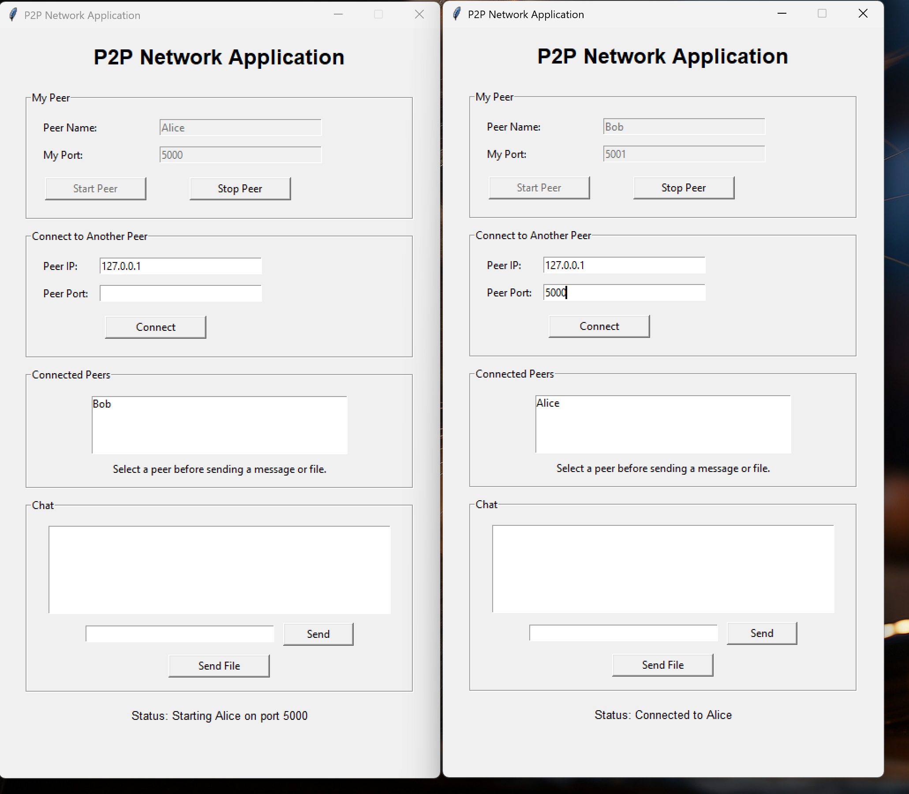
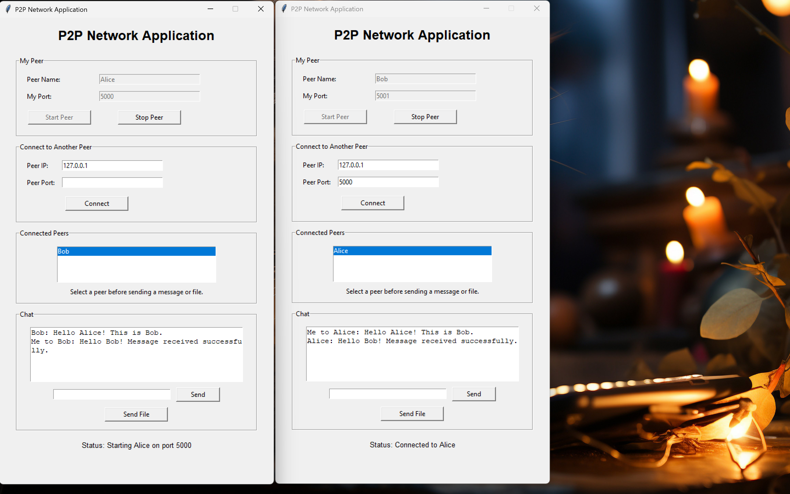
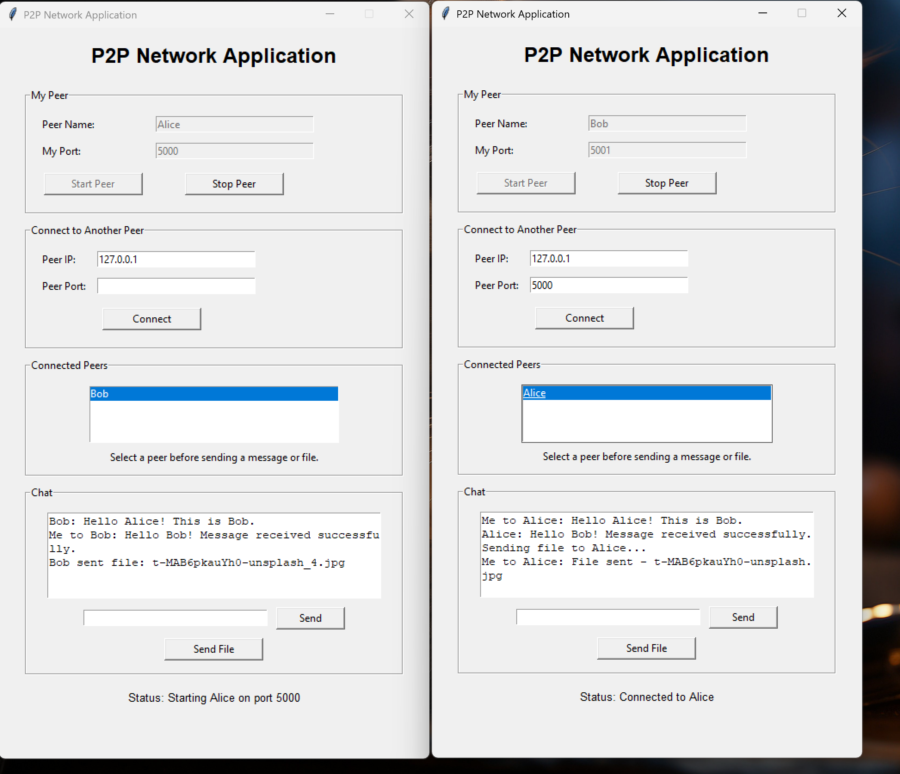
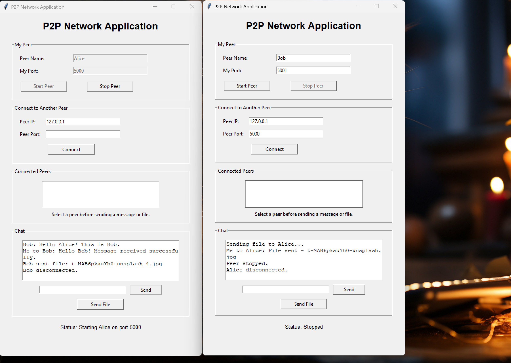
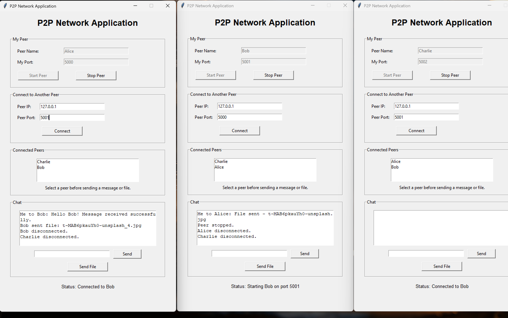

# TCP-Based Peer-to-Peer (P2P) Network Application

A Python-based TCP Peer-to-Peer (P2P) Network Application with a graphical user interface developed using Tkinter. The application enables multiple peers to communicate directly, exchange text messages, and transfer files without relying on a central messaging server.

This project demonstrates the practical implementation of TCP socket programming, multithreading, JSON-based communication protocols, and file handling in Python.

---

## 1. Project Overview

The TCP-Based Peer-to-Peer (P2P) Network Application is a desktop application that allows multiple users to establish direct network connections.

Each peer can operate as both a server and a client. A peer listens for incoming connections while also being able to connect to other peers using their IP addresses and port numbers.

The application provides a simple graphical interface for managing peer connections, exchanging text messages, and transferring files.

### Project Objectives

- Implement direct peer-to-peer communication using TCP sockets.
- Develop a graphical user interface using Tkinter.
- Support multiple peer connections.
- Enable two-way text messaging.
- Implement file transfer using binary data chunks.
- Handle peer disconnections and connection errors.
- Demonstrate communication between three peers.

---

## 2. Key Features

### Peer Connection Management

- Start and stop a peer from the graphical interface.
- Connect to another peer using an IP address and port number.
- Maintain multiple peer connections.
- Display connected peers in a list.
- Detect and handle peer disconnections.
- Restart and reconnect a stopped peer.

### Text Messaging

- Send and receive text messages between connected peers.
- Select a specific peer before sending a message.
- Display sent and received messages in the chat area.
- Support two-way communication.

### File Transfer

- Transfer files directly between connected peers.
- Support TXT, JPG, PNG, PDF, ZIP, MP3, WAV, MP4, and other file types.
- Transfer file content as binary data in chunks.
- Save received files in the `downloads` folder.
- Avoid overwriting existing files with duplicate names.

### Graphical User Interface

- Peer name and listening port inputs.
- Start Peer and Stop Peer buttons.
- Remote peer connection controls.
- Connected peers list.
- Chat history and message input.
- Send Message and Send File controls.
- Connection status messages.

### Error Handling

- Invalid port input.
- Failed connection attempts.
- Sending without selecting a connected peer.
- Peer disconnections.
- File transfer and network errors.

---

## 3. Technologies Used

| Technology | Purpose |
|---|---|
| Python 3 | Main programming language |
| Tkinter | Graphical user interface |
| TCP Sockets | Network communication |
| JSON | Structured message exchange |
| Threading | Concurrent peer communication |
| File Handling | Sending and receiving files |
| Visual Studio Code | Development environment |

The application uses Python standard library modules and does not require additional third-party Python packages.

---

## 4. Project Structure

```text
TCP-P2P-Network-Application/
│
├── main.py
├── p2p_node.py
├── protocol.py
├── requirements.txt
├── README.md
│
└── screenshots/
    ├── README.md
    ├── 01_Alice_GUI.png
    ├── 02_Peer_Connection.png
    ├── 03_Text_Chat.png
    ├── 04_File_Transfer.png
    ├── 05_Peer_Disconnection.png
    └── 06_Three_Peer_Connection.png
```

The `downloads` folder is created automatically when received files need to be saved.

### File Descriptions

**`main.py`**

Implements the Tkinter graphical user interface and manages user interactions, including peer startup, connections, text messaging, file selection, and peer shutdown.

**`p2p_node.py`**

Handles TCP socket connections, server operations, peer management, incoming messages, outgoing messages, file transfer, and disconnection handling.

**`protocol.py`**

Defines the communication protocol and handles JSON message formatting, length-prefixed message transmission, and binary file transfer.

**`requirements.txt`**

Documents the Python dependency requirements.

**`screenshots/`**

Contains screenshots demonstrating the application's features and testing results.

---

## 5. System Requirements

Before running the application, make sure your computer has:

- Python 3 installed.
- Tkinter available in the Python installation.
- A terminal or command prompt.
- Visual Studio Code or another Python-compatible development environment (optional).

No additional third-party Python packages are required.

---

## 6. Installation and Setup

### Step 1: Download the Project

Open the GitHub repository:

https://github.com/naima-tabassum/TCP-P2P-Network-Application

Click:

**Code → Download ZIP**

Extract the downloaded ZIP file to a folder on your computer.

Alternatively, clone the repository using Git:

```bash
git clone https://github.com/naima-tabassum/TCP-P2P-Network-Application.git
```

### Step 2: Open the Project Folder

Open the extracted project folder in Visual Studio Code or a terminal.

If you cloned the repository, enter the project directory:

```bash
cd TCP-P2P-Network-Application
```

### Step 3: Run the Application

Execute:

```bash
python main.py
```

If your system uses `python3` instead of `python`, run:

```bash
python3 main.py
```

The P2P Network Application GUI should open.

---

## 7. How to Use the Application

### Step 1: Start a Peer

1. Open the application.
2. Enter a peer name.
3. Enter an available listening port.
4. Click **Start Peer**.

The application will start listening for incoming connections.

### Step 2: Start Another Peer

Open another instance of the application.

Enter a different peer name and listening port.

For example:

| Peer | IP Address | Port |
|---|---|---|
| Alice | 127.0.0.1 | 5000 |
| Bob | 127.0.0.1 | 5001 |
| Charlie | 127.0.0.1 | 5002 |

Each peer must use a different listening port when running on the same computer.

### Step 3: Connect Two Peers

For example, to connect Bob to Alice:

1. Open Bob's GUI.
2. Enter Alice's IP address: `127.0.0.1`.
3. Enter Alice's listening port: `5000`.
4. Click **Connect**.

After successful connection, Alice will appear in Bob's connected peers list, and Bob will appear in Alice's connected peers list.

### Step 4: Send a Text Message

1. Select a peer from the Connected Peers list.
2. Enter a message in the message box.
3. Click **Send**.

The receiving peer will see the message in the chat area.

### Step 5: Transfer a File

1. Select a connected peer.
2. Click **Send File**.
3. Choose a file from your computer.
4. Wait for the transfer to complete.

The receiving peer will save the file in the `downloads` folder.

### Step 6: Stop a Peer

Click **Stop Peer** to stop the local peer.

Connected peers will be disconnected, and other peers can continue communicating with their remaining connections.

A stopped peer can be restarted and reconnected.

---

## 8. Communication Protocol

The application uses TCP sockets for reliable, connection-oriented communication.

A custom communication protocol is implemented using JSON messages and binary file transfer.

### Message Types

| Message Type | Purpose |
|---|---|
| `HELLO` | Initiates communication between peers |
| `HELLO_ACK` | Acknowledges the connection |
| `TEXT` | Transfers text messages |
| `FILE` | Transfers file metadata before binary data |

### Message Framing

JSON messages use a four-byte length prefix.

The first four bytes indicate the size of the JSON message. The receiver then reads the corresponding message data.

### File Transfer Process

1. The sender selects a file.
2. File metadata is sent using a `FILE` message.
3. The receiver reads the metadata.
4. File content is transmitted as raw binary data.
5. The data is processed in 64 KB chunks.
6. The receiver saves the file in the `downloads` folder.

This approach supports transferring different file types without converting the entire file into JSON.

---

## 9. Application Screenshots

The following screenshots demonstrate the main features of the TCP-Based P2P Network Application.

### 9.1 Main GUI

The main graphical interface provides peer startup controls, connection settings, a connected peers list, and messaging features.



### 9.2 Peer Connection

This screenshot demonstrates a successful TCP connection between Alice and Bob.



### 9.3 Two-Way Text Chat

Alice and Bob exchange text messages through the application.



### 9.4 File Transfer

A file is transferred between connected peers, and the receiving peer displays the corresponding transfer information.



### 9.5 Peer Disconnection

The application detects a peer disconnection and updates the connected peers list.



### 9.6 Three-Peer Connection

Alice, Bob, and Charlie establish multiple peer-to-peer connections.



---

## 10. Testing and Results

The application was manually tested using multiple instances on the same computer.

Three peers were used during testing:

- Alice — Port 5000
- Bob — Port 5001
- Charlie — Port 5002

### Functional Testing

| Test Case | Result |
|---|---|
| Start Peer | Passed |
| Stop Peer | Passed |
| Restart Peer | Passed |
| Connect Two Peers | Passed |
| Connect Three Peers | Passed |
| Two-Way Text Messaging | Passed |
| JPG File Transfer | Passed |
| PNG File Transfer | Passed |
| PDF File Transfer | Passed |
| ZIP File Transfer | Passed |
| Audio File Transfer | Passed |
| Video File Transfer | Passed |
| File Transfer Larger Than 5 MB | Passed |
| Invalid Port Handling | Passed |
| Failed Connection Handling | Passed |
| Sending Without Selecting a Peer | Passed |
| Peer Disconnection Handling | Passed |
| Communication Between Remaining Peers | Passed |
| Reconnection After Restart | Passed |
| Text Messaging After Reconnection | Passed |

All listed tests were completed during local testing using the loopback address `127.0.0.1`.

---

## 11. Limitations

- Peer connections require manually entering an IP address and port number.
- The application does not provide automatic peer discovery.
- Disconnected peers must be reconnected manually.
- Network communication is not encrypted.
- Interrupted file transfers may leave incomplete files.
- The application was tested locally on one computer. Communication across separate computers or networks has not yet been verified.

---

## 12. Future Improvements

Possible improvements include:

- Automatic peer discovery.
- Encrypted communication.
- File transfer progress indicators.
- Improved handling of interrupted transfers.
- Additional connection management features.

These are potential future enhancements and are not part of the current implementation.

---

## 13. Conclusion

This project demonstrates the development of a TCP-based Peer-to-Peer Network Application using Python.

Through this project, practical experience was gained in socket programming, multithreading, JSON-based communication, file handling, and graphical interface development.

The application successfully supports direct communication between multiple peers, two-way text messaging, file transfer, peer disconnection handling, and reconnection through a simple Tkinter interface.

The completed application provides a practical foundation for understanding peer-to-peer networking and TCP socket communication.
